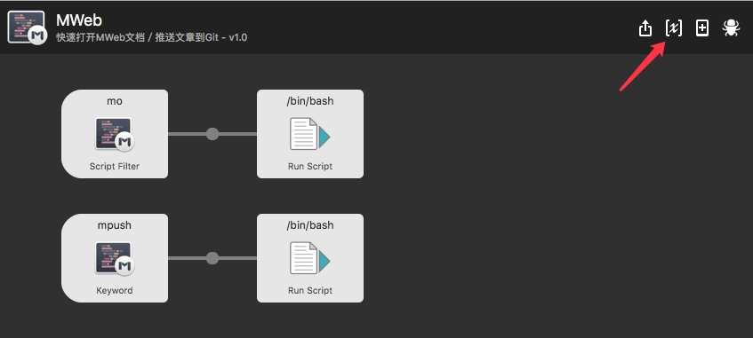
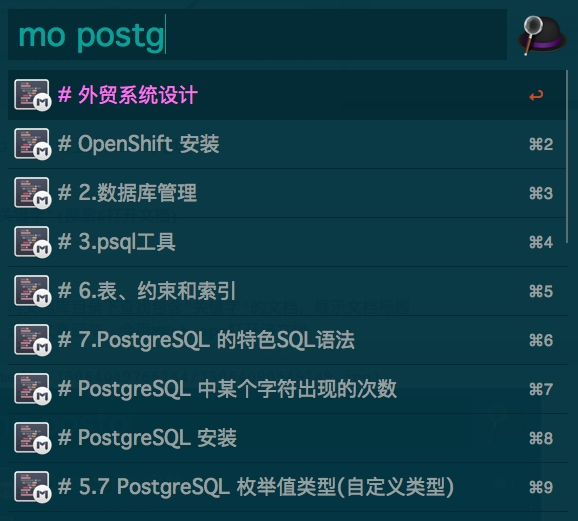

# MWeb workflow

## 设置环境变量(必须设置)

1.打开MWeb workflow 的环境变量设置页面

2.打开MWeb偏好设置,复制对应路径到workflow变量中

MBLOG_URL 填上的你Blog地址(如果使用了MWeb的静态博客功能)

## "mo 关键字"(搜索&打开文档)

功能：

* 1. 再文档库目录下查找包含"关键字"的文档，展示文档标题
* 2. 选中文章回车，会用MWeb app打开该文档

## "mpush" (提交生成的静态博客到远端Git(Hub)
我用的是GitHub做静态博客，在用MWeb生成网站之后，需要做 git add ...;  git commit ;git push等一序列操作才能把最新文章推送到GitHub，博客才更新，所以做了一个一键push功能

使用方法：

1. 按前面的方法设置 MBLOG_HOME 变量 MBLOG_URL变量(一次性)
2. 用MWeb生成生成网站
3. 使用mpush 一键推送到GitHub或者别的远程git地址
4. push完成之后会打开博客地址(用浏览器)

静态博客使用方法请参考 MWeb 官方文档，这里只是做了一键push操作

