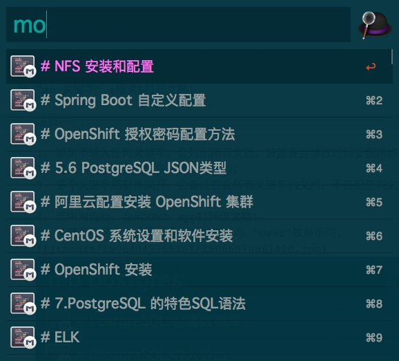
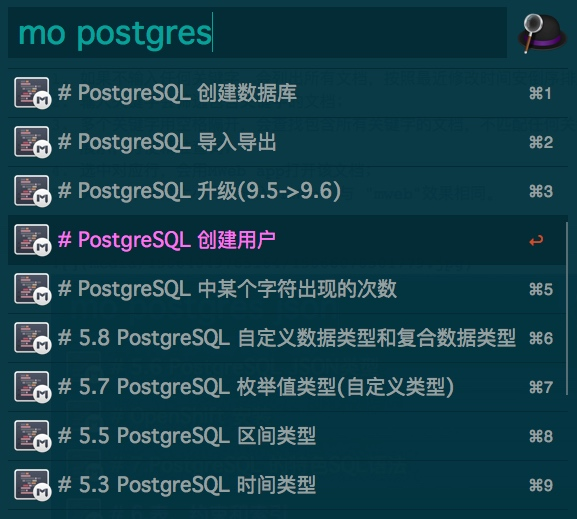
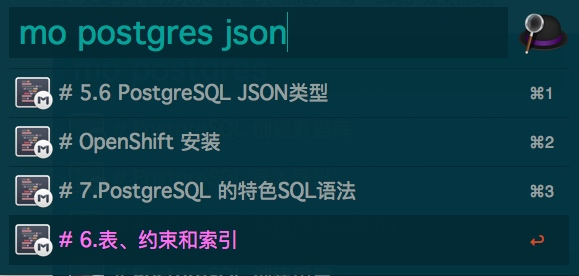
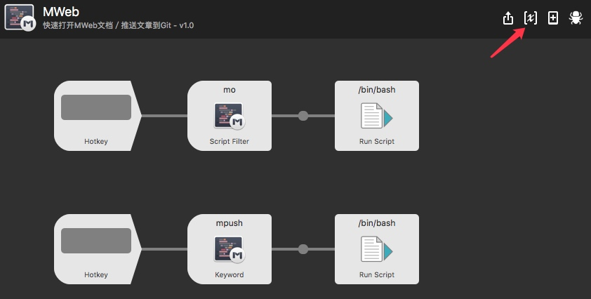
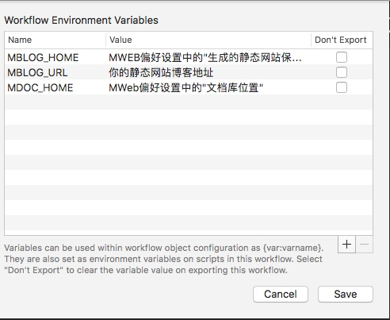
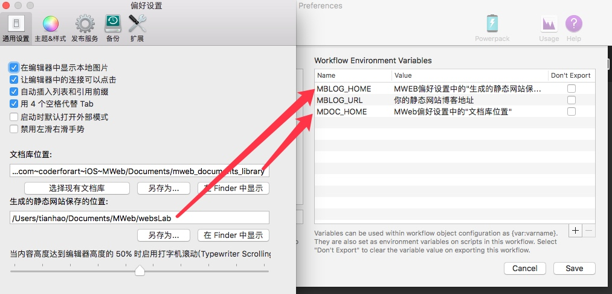
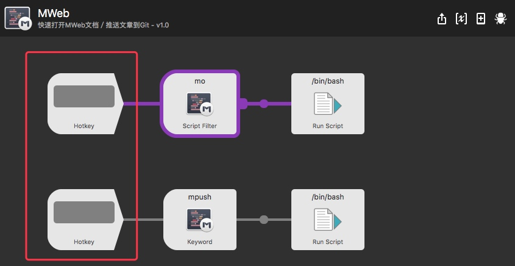

# MWeb workflow
[下载](https://github.com/tianhao/alfred-mweb-workflow/raw/master/MWeb.alfredworkflow)

使用前请参照最后一节 "设置环境变量" 配置

## 搜索&打开文档


使用方法:
用户可以使用关键字 "mo" 或者自定义快捷键触发 workflow

```
mo [-t tag1,tag2...] [keyword1] [keyword2]...
hotkey-> [-t tag1,tag2...] [keyword1] [keyword2]...
```
示例

```BASH
# 不输入任何参数，按最近修改时间排序文档
mo 
# 查找有 alfred 关键字的文档
mo alfred
# 查找有 alfred 和 workflow 两个关键字的文档
mo alfred workflow
# 查找tag含有 TODO 的文档，tag不区分大小写
mo -t TODO
# 查找tag同时包含 TODO 和 DONE 的文档, tag之间以,隔开(中文逗号，也可以)，但tag名称不能有空格
mo -t TODO,DONE
# 查找 tag含有 TODO, 且有alfred 和 workflow 两个关键字的文档
mo -t TODO alfred workflow
# -t 如果不是第一个参数 会作为关键字，所以这里查找含有这4个关键字的文档：alfred workflow -t TODO 
mo alfred workflow -t TODO 
```

功能说明：

1. 如果不输入任何关键字，会列出所有文档，按照最近修改时间安倒序排序；
2. 输入关键字会筛选包含关键字的文档；
3. 多个关键字用空格隔开，会查找包含所有关键字的文档，不匹配任何关键字或只匹配部分关键字的文档不会展示，方便精准查询；
4. 选中对应行，回车，会用MWeb app打开该文档；
5. 关键字不区分大小写，输入"MWeb" 与 "mweb"效果相同。
6. `-t tag1[,tag2...]` 放在开头可以查找包含tag的文档，tag之间以逗号隔开(中文逗号也可以)，tag不区分大小写
7. `-t tag1[,tag2...]` 放在最前面才有效，目前不支持tag包含空格的情况。

不带关键字，列出所有文档



一个关键字



多个关键字



## "mpush" (提交生成的静态博客到远端Git(Hub)
我用的是GitHub做静态博客，在用MWeb生成网站之后，需要做 git add ...;  git commit ;git push等一序列操作才能把最新文章推送到GitHub，博客才更新，所以做了一个一键push功能

使用方法：

1. 按设置环境变量的方法设置 MBLOG_HOME 变量 MBLOG_URL变量(一次性)
2. 用MWeb生成生成网站
3. 使用mpush 一键推送到GitHub或者别的远程git地址
4. push完成之后会打开博客地址(用浏览器)

静态博客使用方法请参考 MWeb 官方文档，这里只是做了一键push操作


## 设置环境变量(必须设置)

1. 打开MWeb workflow 的环境变量设置页面




2. 打开MWeb偏好设置,复制对应路径到workflow变量中



MBLOG_URL 填上的你Blog地址(如果使用了MWeb的静态博客功能)


3. 设置快捷键（可选）

workflow 默认没有设置 mo 和 mpush 的快捷键，用户可以按照自己的需要设置快捷键



