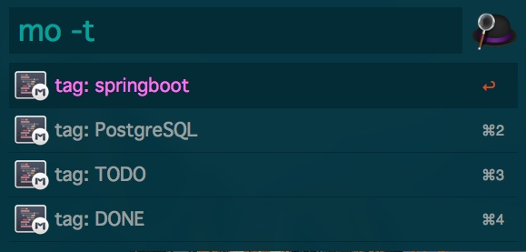
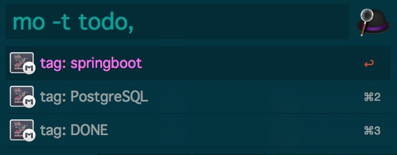
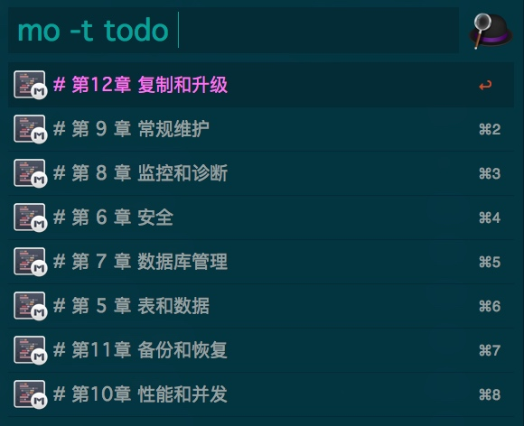
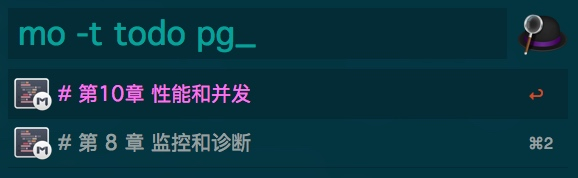

# MWeb workflow
[下载](https://github.com/tianhao/alfred-mweb-workflow/raw/master/MWeb.alfredworkflow)

使用前请参照最后一节 "设置环境变量" 配置

## 搜索&打开文档


使用方法:
用户可以使用关键字 "mo" 或者自定义快捷键触发 workflow

```
mo [-t tag1,tag2...] [-h keyword1,keyword2,...]  [keyword1] [keyword2]...
hotkey-> [-t tag1,tag2...] [-h keyword1,keyword2,...] [keyword1] [keyword2]...
```

示例

```BASH
# 不输入任何参数，按最近修改时间排序文档
mo 
# 查找有 alfred 关键字的文档
mo alfred
# 查找有 alfred 和 workflow 两个关键字的文档
mo alfred workflow
# 查找tag含有 TODO 的文档，tag不区分大小写
mo -t TODO
# 查找tag同时包含 TODO 和 DONE 的文档, tag之间以,隔开(中文逗号，也可以)，但tag名称不能有空格
mo -t TODO,DONE
# 查找 tag含有 TODO, 且有alfred 和 workflow 两个关键字的文档
mo -t TODO alfred workflow
# 与上面输入等效
mo alfred workflow -t TODO 
# 查找标题包含关键字 alfred 和 workflow 的文档
mo -h alfred,workflow
# 查找标题包含关键字 alfred 和 workflow，且文档包含 mweb 关键字的文档
mo -h alfred,workflow mweb
```

**功能说明**：

1. 如果不输入任何参数，会列出最近修改过的20个文档，按照最近修改时间安倒序排序，即使输入了参数过滤，也最多输出20条记录；
2. 目前支持3种可选过滤参数，tag参数(-t)、title参数和关键字参数，会根据参数过滤文档并做好排序,tag参数参考下面[tag选项]，title参数参考下面[title选项]；
3. 你可以输入多个关键字过滤，中间以空格隔开，workflow 会用查找包含所有关键的的文档，只有包含所有关键字的文档才会列出来，所以关键字越多越精确；
4. 选中对应行，回车，会用MWeb app打开该文档；
5. 关键字不区分大小写，输入"MWeb" 与 "mweb"效果相同。

**tag选项(-t)**:

1. 输入 `-t tag1[,tag2,...]` 触发workflow查找包含所有输入tag的文档，只有包含所有输入tag的文档才会显示；
2. tag之间以逗号","隔开，tag不区分大小写，逗号也不区分中英文；
3. 当输入-t 时，会触发展示可选的tag列表，选中需要的tag回车，workflow会将选中的tag加入选项中，并让你可以继续选择别的tag，如果你已经选好了需要的tag；
4. 如果你已经选好了需要的tag，再输入一个空格会关闭tag列表，并且展示过滤后的文档，这是敲回车会打开对应的文档。

**title选项(-h),由于-t用在了tag上，所以用-h(header)触发标题过滤**:

1. 使用 `-h keyword1[,keyword2,...]` 触发标题过滤；
2. 可以输入多个关键字，标题的关键字之间以","号隔开，关键字不区分大小写，逗号也不区分中英文；
3. title过滤会过滤第一行包含所有标题关键字的文档，与其它选项组合使用

不带关键字，列出前20个最近改过的文档


一个关键字


多个关键字


tag列表: `-t` 触发 tag 选项



tag列表：输入一个tag后，输入下一个tag前会将上一个从列表剔除



tag输入完成再输入一个空格，会展示tag过滤结果



tag(todo) 和 关键字(pg_) 组合过滤文档



## "mpush" (提交生成的静态博客到远端Git(Hub)
我用的是GitHub做静态博客，在用MWeb生成网站之后，需要做 git add ...;  git commit ;git push等一序列操作才能把最新文章推送到GitHub，博客才更新，所以做了一个一键push功能

使用方法：

1. 按设置环境变量的方法设置 MBLOG_HOME 变量 MBLOG_URL变量(一次性)
2. 用MWeb生成生成网站
3. 使用mpush 一键推送到GitHub或者别的远程git地址
4. push完成之后会打开博客地址(用浏览器)

静态博客使用方法请参考 MWeb 官方文档，这里只是做了一键push操作


## 设置环境变量(必须设置)

1.打开MWeb workflow 的环境变量设置页面


2.打开MWeb偏好设置,复制对应路径到workflow变量中


MBLOG_URL 填上的你Blog地址(如果使用了MWeb的静态博客功能)

3.设置快捷键（可选）

workflow 默认没有设置 mo 和 mpush 的快捷键，用户可以按照自己的需要设置快捷键


